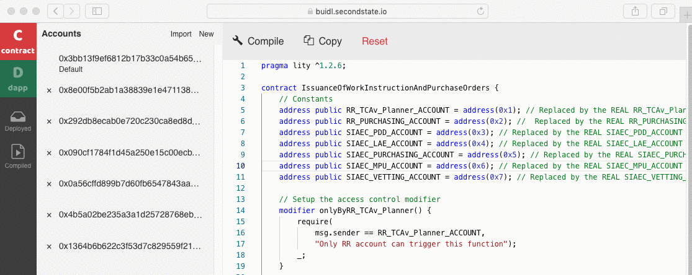

# Enviroment Setup

We provide two solutions to use our smart contracts and blockchain.
1. Use blockchain environment by Second State.
2. Build your blockchain by Second State BaaS solution.

## Use blockchain environment by Second State

You can copy and execute smart contracts from this repository to BUIDL by following steps.

### Copy Smart Contract from this repository to BUIDL, the Second State Smart Contract IDE

#### 1. Copy the content of `contracts/RRBIC.lity`.

#### 2. Open your browser and connect to [BUIDL](https://buidl.secondstate.io/)
  - 

#### 3. Paste the content of `contracts/RRBIC.lity` to [BUIDL](https://buidl.secondstate.io/) 
  - 

#### 4. Create accounts and let total accounts be 7 to simulate Airline, RR Purchasing, SIAEC PDD, SIAEC LAE, SIAEC Purchasing, MRO, and Aircraft OEM
  - 

#### 5. Paste the addresses of created accounts to the smart contract in BUIDL.
  - 

#### 6. Compile and Deploy the smart contract
  - 

#### 7. Execute `Step 4:Issuance of Work Instructions and Purchase Orders`
//POid starts from 0, and increase by iteration. In following demos, we will use `POid=0` to show following steps.

1. RR_TCAv_Planner calls `entryPoint()`
    1. `entryPoint()` will call the following two functions:
        1. `issueWorkInstruction("XYZ Air", "XX::KXKX", "BICX1")`
            1. In this function, it will send the WI to SIAEC PDD.
            2. And cc the WI to Airline MPC as well.
        2. `issuePurchaseOrders("ServiceName", "XYZ Air")`
            1. In this function, it will create and send the PO to SIAEC PURCHASING.
2. SIAEC PURCHASING will need to update PO by calling `fillUpPO(POid)` 
    1. If the service name is not in the catalogues, this function will emit `createQuoteWithPOid(POid)` and `sendQuoteToRR(POid)` to retrieve the Quote information.
    2. Otherwise, it will update PO from the existed catalogues.
3. (Optional, if 2-1 happens) RR PURCHASING will need to reply the Quote Price by calling `replyQuotePrice(POid, Price)`
4. (Optional, if 3 happens) SIAEC PURCHASING will need to approve Quote by calling `approveQuote(POid)`

#### 8. Execute `Step 5:Issuance of Task Cards and Work Plan Update`

1. When SIAEC PDD received WI from RR TCAv_Planner. SIAEC PDD will generate the task card for this WI by calling `generateTaskCards(WIid)`
2. And SIAEC PDD will issue this Task Card to SIAEC LAE and add it into Work Plan by calling `issueTaskCardToWorkPlan(WIid)`

#### 9. Assume Step 6, 7 are finished

1. SIAEC MPU will call `assumeStep7UpdateTask(WIid)` to mark the task related to current WI is completed.

#### 10.  Jump to `Step 17:Job Completion and Billing`.

1. SIAEC VETTING will be the entry point of this step by calling `prepareToCloseWI(WIid)`.
    1. In this function, it will contains two phases:
        1. SIAEC VETTING will update tech records and task to the ERP system by calling `sendDocsToERP()`
        2. SIAEC VETTING will create the billing information and send it to the RR PURCHASING by `createBilling(WIid)` and `sendBillingToRR(WIid)`.
2. When RR PURCHASING received billing information, it will need to approve this billing by `approveBilling(WIid)`.
3. When SIAEC VETTING checked the billing state is approval, it will create and send invoice back to RR PURCHASING by `createInvoice(WIid)` and `sendInvoice(WIid)`.
4. After RR PURCHASING received invoice, it will need to approve this invoice by `approveInvoice(WIid)`
5. After RR PURCHASING approved this invoice, SIAEC VETTING will make the payment by `pay(WIid)`.

## Build blockchain by yourself

### Operating System Requirement

* Ubuntu 16.04+ or CentOS 7

### Setup Second State Devchain

Please refer to [our online documentation](https://docs.secondstate.io/devchain/getting-started) for more detials.

Please remember your URLs, which represent your blockchain’s RPC node and ElasticSearch service. We will use them at the next step to setup our BUIDL IDE.

### Setup BUIDL, Second State Online IDE

After you finished the Devchain setup, please use the following steps to connect your devchain with our BUIDL IDE.

1. Access the BUIDL IDE from your browser: https://buidl.secondstate.io/
2. Connect your own devchain to our BUIDL
	1. Click `Providers` icon to active BUIDL config panel.
	2. Set the `Set ES Provider Endpoint` to `Customize`.
		1. Put your URL of ES Provider Endpoint here.
	3. Set the `Set Web3 Provider Endpoint` to `Customize`.
		1. Put your URL of Web3 Provider Endpoint here.
		2. Set your Chain ID here, please make sure the Chain ID is the same as devchain.
	4. If you want to set the Transaction Gas Limit or Gas Price, click the checkbox `Custom Tx Gas`.
3. Once you are done, your BUIDL contracts and DApps will now deploy to the new blockchain!

### Upload and Execute RRBIC smart contract

This part will be the same as shown in the `## Copy Smart Contract from this repository to BUIDL, the Second State Smart Contract IDE.`

